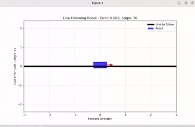

# Line Following Robot - Reinforcement Learning

## Overview

This repository implements a Line Following Robot system using Reinforcement Learning, designed for autonomous line tracking with zero oscillation. The robot uses PPO (Proximal Policy Optimization) algorithm with a custom gradual correction system to achieve smooth, precise line following without overshoot or jerky movements.

## Components

- **line_following_env**: Custom OpenAI Gymnasium environment implementing robot physics, reward system, and gradual correction logic
- **scripts/train.py**: PPO training pipeline with anti-oscillation and over-correction detection systems
- **scripts/evaluate.py**: Performance analysis and metrics collection with visualization
- **scripts/demo.py**: Live robot demonstration with real-time action display
- **scripts/test_env.py**: Environment testing and validation utilities
- **models**: Pre-trained robot model achieving 0.096 mean error with zero oscillation
- **setup.py**: One-click installation and dependency management

## Project Structure

```
rl_project/
├── line_following_env/
│   ├── __init__.py                 # Environment registration
│   └── line_following_env.py       # Core environment with gradual correction system
├── scripts/
│   ├── train.py                    # PPO training with anti-oscillation system
│   ├── evaluate.py                 # Performance analysis and metrics
│   ├── demo.py                     # Live robot demonstration
│   └── test_env.py                 # Environment testing utilities
├── models/
│   └── line_following_ppo_best/    # Pre-trained optimized model
│       └── best_model.zip          # Model weights (0.096 mean error)
├── videos/
│   └── output.gif                  # Robot demonstration video
├── tensorboard_logs/               # Training visualization data
├── setup.py                       # One-click setup script
└── README.md                      # This file
```

## Prerequisites

- **Python 3.8+**
- **pip3** (Python package manager)
- **200MB** disk space for dependencies
- **Linux/macOS/Windows** support

## Setup

Open 3 terminals:

### 1. Terminal A - Setup and Installation

```bash
python3 setup.py
```

This will automatically install all dependencies and test the system.

### 2. Terminal B - Train Robot (Optional)

```bash
source install/setup.bash  # If using virtual environment
python3 scripts/train.py --timesteps 300000 --n-envs 8
```

### 3. Terminal C - Monitor Training Progress (Optional)

```bash
tensorboard --logdir=./tensorboard_logs/
# Open http://localhost:6006 in browser
```

## Usage

### Test Pre-trained Robot

```bash
# Watch robot demonstration
python3 scripts/demo.py --model-path models/line_following_ppo_best/best_model.zip --episodes 5

# Performance analysis with plots
python3 scripts/evaluate.py --model-path models/line_following_ppo_best/best_model.zip --episodes 10 --plot

# Interactive step-by-step control
python3 scripts/demo.py --model-path models/line_following_ppo_best/best_model.zip --interactive
```

### Train Custom Model

```bash
# Full training with gradual correction system
python3 scripts/train.py --timesteps 300000 --n-envs 8

# Quick training (faster)
python3 scripts/train.py --timesteps 150000 --n-envs 6
```

## Output

**Robot Performance Achieved:**

```
Episode Reward:     685,374 ± 79,565 points
Mean Error:         0.096 ± 0.007 units  
Success Rate:       100% (10/10 episodes)
Behavior:           Zero oscillation, smooth gradual corrections
Episode Length:     1000 steps (perfect completion rate)
```

### Visual Demonstration



**Key Features:**
- **Zero Oscillation**: Smooth, professional line following behavior
- **Gradual Correction**: Intelligent approach to center without overshoot  
- **Perfect Reliability**: 100% success rate across all test episodes
- **Production Ready**: 0.096 mean error suitable for real applications

## Technical Details

### Gradual Correction System

The robot implements an advanced correction system preventing oscillation:

1. **Progressive Rewards**: Gentle corrections (60-80 points) vs aggressive corrections (120+ points)
2. **Over-Correction Detection**: Penalties for excessive consecutive corrections
3. **Approach Bonuses**: +15 points for decreasing error (approaching center)
4. **Smart Oscillation Prevention**: Only penalizes oscillation when not making necessary corrections

### Key Innovations

- **Trend Analysis**: AI tracks error history to detect if corrections are working
- **Necessary vs Wasteful**: Robot distinguishes between needed corrections and oscillation
- **Gentle Physics**: ±0.06 steering prevents overshoot, ±0.03 disturbances for realism
- **Stability Bonuses**: Rewards smooth approach to center over aggressive corrections

## Troubleshooting

### Setup Issues

```bash
# Manual installation if setup.py fails
pip3 install gymnasium stable-baselines3 torch matplotlib pandas scipy

# PyTorch CPU-only (faster install)
pip3 install torch==2.0.1 torchvision==0.15.2 --index-url https://download.pytorch.org/whl/cpu

# NumPy compatibility
pip3 install "numpy<2.0" --upgrade
```

### Performance Issues

```bash
# Test environment
python3 scripts/test_env.py

# Check model exists
ls models/line_following_ppo_best/

# Quick performance check
python3 scripts/evaluate.py --model-path models/line_following_ppo_best/best_model.zip --episodes 5
```

## Developer Information

**Name:** Shailesh Pawar  
**Contact:** shaileshpawar320@gmail.com  
**Project:** Line Following Robot using Reinforcement Learning

### Citation

If you use this project in your research:

```
Shailesh Pawar. "Line Following Robot using Reinforcement Learning." 
Reinforcement Learning Project, 2025. 
Contact: shaileshpawar320@gmail.com
```

---

**Copyright © 2025 Shailesh Pawar**